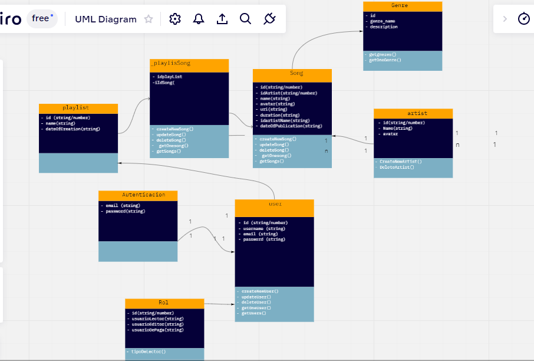

# Titulo: Spotplay
---
## Overview: Problema a resolver
Spotplay es una nueva compañía de música online que tiene como objetivo proporcionar mejores relaciones con los artistas y fans. 

Su producto es _Spotplay_, una plataforma en la que las personas pueden generar  listas de reproducción para sus artistas favoritos y gustos musicales. 

### Alcance(Scope)
  - La aplicacion tendra acceso para usuarios consumidores, a travez de su registro. 
  - La aplicacion tendra acceso para usuarios editores, para dar mantenimiento a la aplicacion.
  - Se tendra disponible dos tipos de cuentas, basico y premium para que los anuncios no sean molestias.
  - Gran cantidad de musica de la mayoria de artistas mas famosos.

#### Casos de uso
Descripcion
* El usuario lector puede crear una nueva lista con un nombre dado.
* El usuario lector puede obtener una lista de usuarios
* El usuario lector puede agregar canciones a una lista determinada
* el usuario editor puede agregar nuevas canciones y artistas
* ...

#### Out of Scope (casos de uso No Soportados)
Descripcion...
* El usuario no puede cambiar valores de la lista de usuarios
* No esta permitido iniciar sesion con cuentas de terceros.
---
## Arquitectura

### Diagramas

### Modelo de datos

---
## Limitaciones
Lista de limitaciones conocidas. Puede ser en formato de lista.
Ej.
* Llamadas del API tienen latencia X
* No se soporta mas de X llamadas por segundo
---
## Costo
Descripción/Análisis de costos
Ejemplo:
"Considerando N usuarios diarios, M llamadas a X servicio/baseDatos/etc"
* 1000 llamadas diarias a serverless functions. $XX.XX
* 1000 read/write units diarias a X Database on-demand. $XX.XX
Total: $xx.xx (al mes/dia/año)